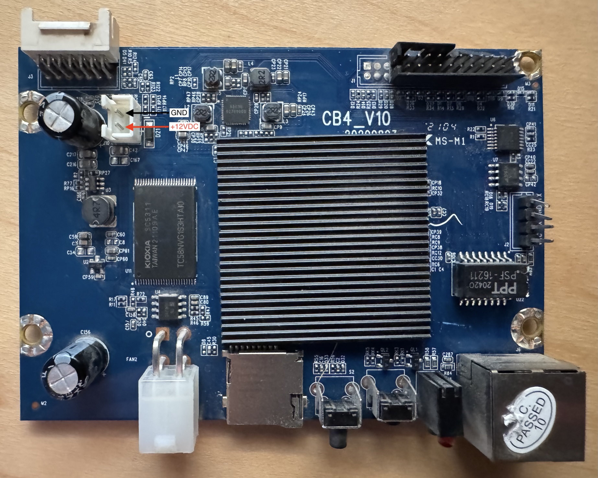

# WhatsMiner H6os SD Recovery Notes

This project contains the working macOS/Openix path for building an SD-card
recovery image for a MicroBT WhatsMiner control board using an Allwinner H6os
platform.

## Power

The CB4_V10 control board can be powered with 12V DC using the 2-pin JST
connector in the upper-left corner.



## Current Result

The working SD-card image boots the control board into Allwinner
PhoenixCard/sprite product mode, flashes NAND, and installs a rescue SSH path.
After flashing, remove the SD card and boot from NAND.

Current local image:

```text
artifacts/images/h6os-v23-access-tmp-home.img
```

SHA256:

```text
a1b5125239baa42385b2ccfb14047999a0e28f8b47fffd07cda51bd82073deb2
```

The original H6os Phoenix image used as input is kept locally as:

```text
artifacts/images/stock-h6os-20220422.18.img
```

SHA256:

```text
78705ecbaf1503494ba671411fcbbd2a7a5c771478d8cc386b4df1cf235e4476
```

`artifacts/` is intentionally ignored by git. Do not commit vendor firmware
images or generated images with personal SSH keys. If you publish release
artifacts, rebuild the access image with the recipient's public key.

## Flash The SD Card On macOS

The generated image is already in the SD-card layout expected by this board.
Write it directly to the SD card.

Example for `/dev/disk4`:

```sh
diskutil unmountDisk /dev/disk4

sudo dd if="artifacts/images/h6os-v23-access-tmp-home.img" \
  of=/dev/rdisk4 bs=4m status=progress conv=sync

sync
diskutil eject /dev/disk4
```

Insert the SD card into the control board and power it on. After flashing
completes, power off, remove the SD card, and boot from NAND.

## SSH Access

The rescue image enables Ethernet and SSH on NAND boot.

Static addresses configured by the rescue script:

```text
192.168.2.254
192.168.1.222
```

Working login:

```text
user: micro
auth: SSH key
uid: 0
```

Use the private key corresponding to the public key embedded during image
generation:

```sh
ssh \
  -o HostKeyAlgorithms=+ssh-rsa \
  -o PubkeyAcceptedAlgorithms=+ssh-rsa \
  -o IdentitiesOnly=yes \
  -i ~/.ssh/id_rsa \
  micro@192.168.1.222
```

There is also a rescue dropbear listener on port `2222`:

```sh
ssh \
  -p 2222 \
  -o HostKeyAlgorithms=+ssh-rsa \
  -o PubkeyAcceptedAlgorithms=+ssh-rsa \
  -o IdentitiesOnly=yes \
  -i ~/.ssh/id_rsa \
  micro@192.168.1.222
```

Confirmed result:

```text
uid=0(root) gid=0(micro) groups=0(micro)
```

The image does not provide a known-good password login. Key auth is the
supported access method.

## Board Identification

The boot logs identify the board as:

```text
Allwinner H6 / H6os
sun50iw6p1
Cortex-A53
256 MiB DRAM
Linux 4.9.170 aarch64
```

The WhatsMiner firmware page has separate packages for `H6` and `H6os`.
This board needs the `H6os` SD-card program. The plain `H6` image is not the
right base image for this board.

https://www.whatsminer.com/src/views/firmware-download.html#Firmware

## Known-Good Boot Evidence

Successful SD-card product-mode flash:

```text
logs/product-flash-success.txt
```

Important markers:

```text
firmware probe ok
fetch download map
total download part 7
successed in download part boot-resource
successed in download part env
successed in download part boot
successed in download part rootfs
successed in download part recovery
successed in download part data
successed in download part data_bak
sunxi_sprite_deal_uboot ok
successed in downloading uboot
successed in downloading boot0
sprite success
```

Successful NAND boot with rescue access:

```text
logs/nand-rescue-success.txt
```

Important markers:

```text
serial-shell: rescue setup start
root:x:0:0:root:/tmp/root-home:/bin/ash
micro:x:0:0:micro:/tmp/root-home:/bin/ash
/tmp/root-home/.ssh/authorized_keys
/etc/dropbear/authorized_keys
eth0:1 inet addr:192.168.1.222
```

## How The Image Works

The stock WhatsMiner `.img` is a PhoenixCard/PhoenixSuit firmware image, not a
simple raw bootable disk image. Openix can extract it, but the generated card
did not fully run product flashing until U-Boot was patched.

The repo does not use Docker Compose. Compose is useful for coordinating
multiple long-running services. Here Docker is only used as a reproducible
Linux tool container for `debugfs`/`e2fsck`, so a small Dockerfile is enough:

```text
docker/ext4-tools/Dockerfile
```

The final SD-card layout is:

```text
boot0_sdcard.fex     sector 16
boot_package.fex     sector 32800
Phoenix IMG payload  sector 40960 / 0xa000
```

The builder script is:

```text
tools/build_phoenix_product_force_sprite.py
```

It patches `boot_package.fex` / U-Boot to:

```text
force work mode 0x11, WORK_MODE_CARD_PRODUCT
run sprite_test read instead of normal NAND boot
set the Phoenix firmware payload start sector to 0xa000
redirect selected sprite flash reads to direct MMC reads
recompute the embedded U-Boot checksum
recompute the outer sunxi-package checksum
```

The Phoenix payload patcher is:

```text
tools/patch_phoenix_data_payload.py
```

It replaces both `DATA_FEX00000000` entries and both `VDATA_FEX0000000`
verifier entries inside the Phoenix image. The verifier is the 32-bit
little-endian word sum of the patched `data.fex` payload.

For v23:

```text
VDATA_FEX = 0x96227115
```

## Rescue Payload Changes

The rescue changes live in the writable `data` / `data_bak` partitions, not in
the encrypted rootfs. The current payload installs `/etc/serial-shell.sh` and
sets `inittab` to run it on `ttyS0`.

The rescue script:

```text
touches /tmp/dropbear_on
rewrites live /etc/passwd and /etc/shadow
creates /tmp/root-home/.ssh/authorized_keys
copies authorized_keys to /etc/dropbear/
assigns eth0 192.168.2.254
assigns eth0:1 192.168.1.222
starts normal dropbear on port 22
starts an extra rescue dropbear on port 2222
prints network and process diagnostics to serial
starts an interactive ash on ttyS0
```

Important quirk: `/root` and `/root/data` are not writable once final userspace
is running, so the SSH home is `/tmp/root-home`.

## Rebuild Notes

The convenient rebuild wrapper is:

```text
tools/build_access_image.sh
```

It injects your SSH public key into `payload/serial-shell.sh.in`, patches
`DATA_FEX`, and builds the final SD-card image. It needs the stock Phoenix IMG
and an Openix dump directory containing at least:

```text
boot0_sdcard.fex
boot_package.fex
sunxi_mbr.fex
data.fex
```

Example:

```sh
SSH_PUBKEY_FILE=~/.ssh/id_rsa.pub tools/build_access_image.sh \
  --stock-img artifacts/images/stock-h6os-20220422.18.img \
  --dump-dir artifacts/openix-dump \
  --output artifacts/images/h6os-access.img
```

Lower-level tools are also available:

```text
tools/patch_phoenix_data_payload.py
tools/build_phoenix_product_force_sprite.py
```

## Quick Verify Commands

Check that a written SD card has the sprite/product U-Boot strings:

```sh
sudo dd if=/dev/rdisk4 bs=512 skip=32800 count=4096 2>/dev/null \
  | strings \
  | grep -E 'bootcmd=|sunxi_sprite|sprite_test'
```

Expected useful strings include:

```text
bootcmd=run b
b=setenv boot_base 40960;sprite_test read
sunxi_sprite_test=sprite_test read
```

Check SSH after NAND boot:

```sh
ping 192.168.1.222
nc -vz 192.168.1.222 22
nc -vz 192.168.1.222 2222
```
